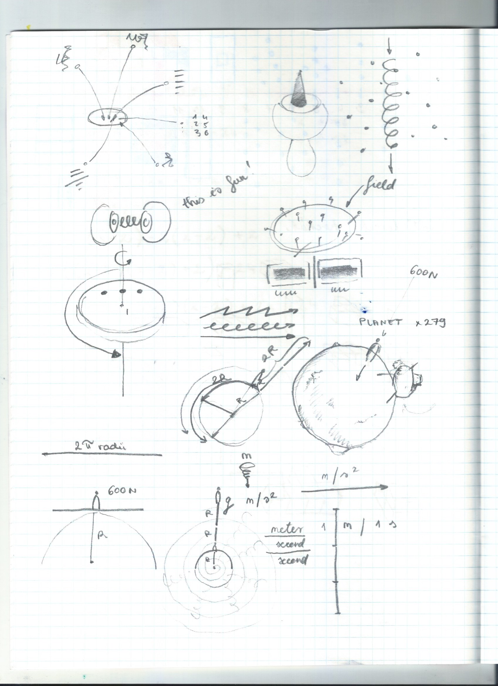

# It’s cold today
I read this good article on learning in public [Learn In Public](https://www.swyx.io/learn-in-public/) . I started doing tasks from [youcubed - Inspire ALL Students with Open, Creative Mindset Mathematics](https://www.youcubed.org/) because I like the idea of visual maths and also I thought that while I learn higher level maths, all sorts of levels of maths, I can go back to the basics and practice visualisation. There was an idea from art uni to take notes visually, and I took some notes visually today while learning the basics of physics.  Learning science is like learning a new language. I watched a lecture on 1.5 speed on linear algebra. The idea occured to me that I will after a while will go around talking an moving in 1.5 speed and people will wonder what is going on with him, and no one will understand me because I speak in science terms. I am happy for Khan Academy and 3blue1brown, I watched all the calculus videos and although I didn’t understand a lot of it I still enjoyed it and now I have some sense about what it is about. To maths anxiety I would suggest the eDx course How to Learn Math [How to Learn Math: For Students | edX](https://www.edx.org/course/how-to-learn-math-for-students-2), and  https://www.coursera.org/learn/learning-how-to-learn and the book Mind for Numbers, and youcubed.org. I’m so happy to have found these resources. I flunked everything in high school and now I am curious to learn. I wonder whether I can insert images to this blog post. Drawing physics examples is fun. What I do is I draw anything, I try to represent ideas in drawing. Visual note taking. [THE PROJECT — Dear Data](http://www.dear-data.com/theproject) a cool project.

